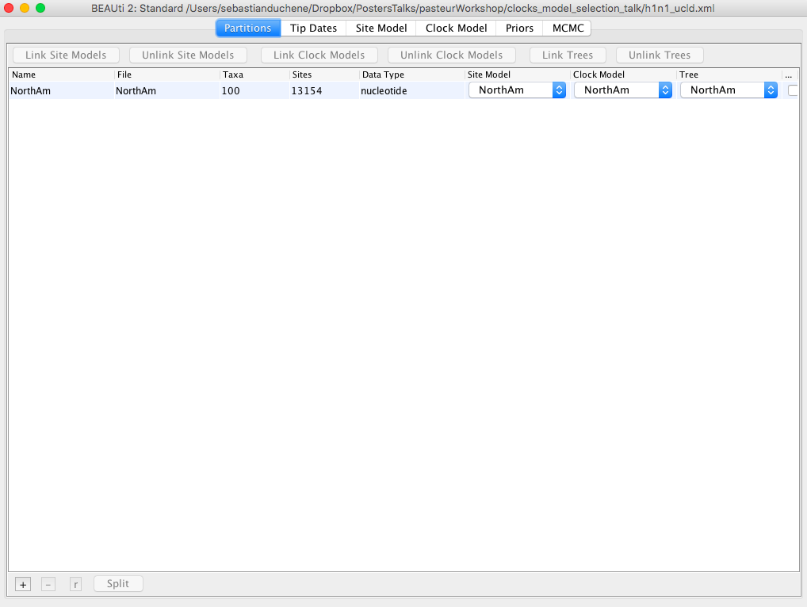
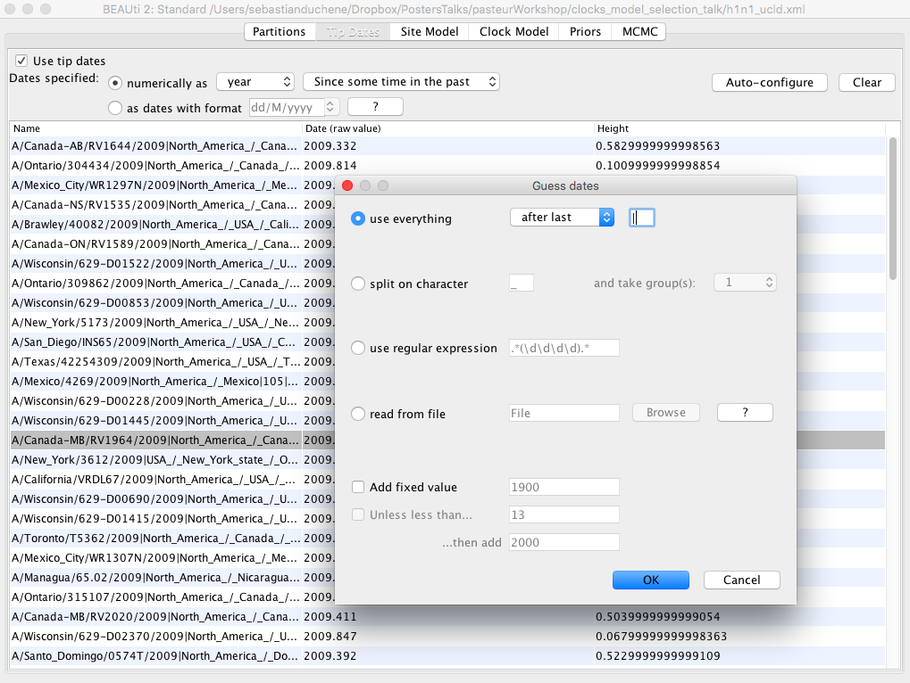

# Background

In this tutorial we will analyse 100 full genome sequences from the 2009 H1N1 flu pandemic in North America. The sequences were collected from about February to November, such that their sampling times can be used for calibration. An important aspect of using sampling times for calibration is that the sampling time should capture a sufficient number of substitutions, i.e. the population should be measurably evolving . One way to verify this is to compare the prior and posterior distribution of the tree height, which we will do here. We will also use a relaxed molecular clock and the bModel test add-on to average over substitution models. In the optional exercises we can compare the estimates from a strict molecular clock model. In a subsequent tutorial we will use the exponential coalescent and constant birth-death model to infer epidemiological parameters.

# Programs used in this Exercise

### BEAST2 - Bayesian Evolutionary Analysis Sampling Trees 2

BEAST2 is a free software package for Bayesian evolutionary analysis of molecular sequences using MCMC and strictly oriented toward inference using rooted, time-measured phylogenetic trees . This tutorial uses the BEAST2 version 2.5.

### bModelTest

bModelTest {CITE} is used to average over substitution models during the MCMC. For installation instructions click [here](http://www.beast2.org/managing-packages/).

### BEAUti2 - Bayesian Evolutionary Analysis Utility

BEAUti2 is a graphical user interface tool for generating BEAST2 XML configuration files.

Both BEAST2 and BEAUti2 are Java programs, which means that the exact same code runs on all platforms. For us it simply means that the interface will be the same on all platforms. The screenshots used in this tutorial are taken on a Mac OS X computer; however, both programs will have the same layout and functionality on both Windows and Linux. BEAUti2 is provided as a part of the BEAST2 package so you do not need to install it separately.

### TreeAnnotator

TreeAnnotator is used to summarise the posterior sample of trees to produce a maximum clade credibility tree. It can also be used to summarise and visualise the posterior estimates of other tree parameters (e.g. node height).

TreeAnnotator is provided as a part of the BEAST2 package so you do not need to install it separately.

### Tracer

Tracer ([http://tree.bio.ed.ac.uk/software/tracer](http://tree.bio.ed.ac.uk/software/tracer)) is used to summarize the posterior estimates of the various parameters sampled by the Markov Chain. This program can be used for visual inspection and to assess convergence. It helps to quickly view median estimates and 95% highest posterior density intervals of the parameters, and calculates the effective sample sizes (ESS) of parameters. It can also be used to investigate potential parameter correlations. We will be using Tracer v{{ page.tracerversion }}.

### IcyTree

IcyTree ([https://icytree.org](https://icytree.org)) is a browser-based phylogenetic tree viewer. It is intended for rapid visualisation of phylogenetic tree files. It can also render phylogenetic networks provided in extended Newick format. IcyTree is compatible with current versions of Mozilla Firefox and Google Chrome.

----

# Setting up the BEAST2 xml

BEAST2 requires the data and model specified in an xml format, which can be done using the program BEAUTI. Open BEAUTI and drag the alignment (NorthAm.Nov.fasta) to this window [Figure 1](#fig:f1). Note that there are several tabs (Partitions, Tip Dates, Site Model, Clock Model, Priors, and MCMC).

<figure>
	<a id="fig:f1"></a>
	
	<figcaption>Figure 1: BEAUTI with h1n1 sequence alignment loaded.</figcaption>
</figure>


Click on the Tip Dates tab and check the box Use tip dates [Figure 2](#fig2:f2).

<figure>
	<a id="fig:f2"></a>
	
	<figcaption>Figure 2: Tip dates enabled in BEAUTI.</figcaption>
</figure>

To use the tip dates as calibrations, click on the Auto-configure button. Check the first box (use everything) and in the dropdown menu, select after last, and type in a vertical line (|) as shown in Fig 2.

The BEAUTI window should now display the dates for each of the sequences under the column date.

Click on the Site Model tab. Instead of using a single substitution model, we will average over those that account for differences in the number of transitions to transversions. In the first drop-down menu select BEAST Model Test. There is a second drop-down menu to select the range of models that we will sample during the MCMC. Select transitionToTransversionSpit to limit our search to those that allow for differences in transitions to transversions. Click on the box Empirical to use the empirical base frequencies. These options should look like those in [Figure 3](#fig:f3).

<figure>
	<a id="fig:f3"></a>
	
	<figcaption>Figure 3: Substitution model set up in BEAUTI.</figcaption>
</figure>


## This is a subsection
Quisque a dictum erat. Curabitur congue sapien sit amet pharetra pretium. Proin posuere euismod velit, eget faucibus ex varius id. Fusce sodales maximus malesuada. Mauris auctor dui in justo interdum egestas. Cras dapibus commodo nulla vitae congue. Vestibulum sit amet justo sit amet ex pretium bibendum. Donec ac mollis lorem, vel semper enim. Suspendisse sit amet auctor dui. Nullam ac efficitur mauris. Proin aliquam tincidunt felis nec semper. Vestibulum vestibulum, eros sit amet consectetur blandit, elit dolor posuere sem, a porta purus odio sit amet quam. Quisque dapibus erat sem, at vulputate libero dapibus sit amet. Mauris rhoncus odio nisl, nec interdum lacus consequat nec. Class aptent taciti sociosqu ad litora torquent per conubia nostra, per inceptos himenaeos.

Etiam tincidunt porttitor rutrum. Nulla facilisi. Mauris vehicula, justo ac ultricies tempus, quam erat hendrerit dui, vel pharetra sapien nibh vel ex. Sed molestie eu dui in laoreet. Pellentesque ultrices, orci vitae lacinia suscipit, erat sapien elementum ligula, sit amet viverra ante lorem eget elit. Cras euismod felis libero, pharetra lobortis arcu congue vehicula. Nullam posuere dapibus mauris, eget vulputate ligula auctor eget. Aenean et tempus est. Aliquam vehicula arcu vitae metus dictum viverra. Aliquam vitae purus mauris. Nullam interdum mauris eget sagittis consequat. Quisque in orci elementum, eleifend tortor eget, bibendum orci. Etiam aliquet dolor non neque semper fermentum. Praesent vitae venenatis mi, ut faucibus ligula. Phasellus vitae lorem neque. Interdum et malesuada fames ac ante ipsum primis in faucibus.

### This is a sub-subsection
Etiam posuere urna ut condimentum sagittis. Suspendisse posuere, ex nec eleifend fringilla, nisl augue posuere augue, elementum mollis justo felis sed purus. Cum sociis natoque penatibus et magnis dis parturient montes, nascetur ridiculus mus. Mauris efficitur eros ut turpis elementum vestibulum. Sed sit amet nisi at nunc luctus laoreet id ac enim. Aliquam elementum risus id urna dictum fringilla. Aenean lobortis, risus euismod molestie pulvinar, massa odio pharetra nulla, vitae facilisis neque magna sed lorem. Praesent ipsum enim, commodo ut pharetra in, sollicitudin ac massa. Donec et interdum mauris. Ut molestie, risus quis fermentum placerat, diam risus posuere nisi, eget viverra tortor neque ac sem. Donec viverra magna non dolor aliquam, in suscipit massa facilisis. Suspendisse congue arcu sed risus consectetur commodo. Aenean metus odio, volutpat at tincidunt id, ullamcorper in dui. Cum sociis natoque penatibus et magnis dis parturient montes, nascetur ridiculus mus. Cras ut sem in odio sodales iaculis non quis neque.

Quisque non mollis massa, nec eleifend dolor. Proin porta elit metus, a lobortis enim venenatis ac. Nam scelerisque consectetur mi et gravida. Vestibulum placerat, est vitae euismod finibus, purus nisl viverra quam, eget condimentum mauris magna vel nisl. Phasellus pretium vitae diam in volutpat. Cras gravida non quam ut consectetur. Vivamus congue vulputate lorem.

## This is another subsection
Praesent sodales est in tempor commodo. Suspendisse nulla metus, gravida eget malesuada vel, viverra eu felis. In vitae leo facilisis, ornare nunc nec, tempor tortor. Duis pretium mi eros, at consequat neque tincidunt eget. Mauris vestibulum venenatis arcu, eget lacinia arcu faucibus ut. Phasellus aliquam dui ipsum, a eleifend lacus fermentum at. Suspendisse congue orci quis ante consequat ornare. Integer a massa blandit, vestibulum eros ut, pulvinar augue. Class aptent taciti sociosqu ad litora torquent per conubia nostra, per inceptos himenaeos.

Quisque a urna a massa congue rhoncus. Donec bibendum tempus velit. Nam varius augue sit amet lacinia hendrerit. Proin tincidunt massa ut mi vestibulum placerat. Phasellus eget dui molestie, aliquet libero efficitur, vehicula ex. Pellentesque ultricies ante leo, eu lobortis odio convallis id. Donec vitae risus dui. Nulla orci velit, ultricies sed finibus quis, blandit quis arcu. Morbi non neque non odio rutrum condimentum. Vivamus libero metus, vehicula vitae elit ac, tincidunt pretium dui. Proin condimentum fringilla diam, blandit blandit nisl dapibus vel. Proin ante felis, accumsan eget ligula et, lobortis dictum nunc. Mauris a ante dignissim ipsum tincidunt tristique.

-------

# Tutorial style guide

## Text styling

This is how to write _italic text_.

This is how to write **bold text**.

This is how to write **_bold and italic text_**.

Do text superscripts like this 7^th, x^2y or  x^(2y + 3z).


## Lists

### Unnumbered lists

- Lorem ipsum dolor sit amet, consectetur adipiscing elit.
- Integer pharetra arcu ut nisl mollis ultricies.
	- Fusce nec tortor at enim cursus dictum.
	- Phasellus nec urna quis velit eleifend convallis sodales nec augue.
- In iaculis turpis in massa facilisis, quis ultricies nibh ultricies.
- Nam vitae turpis eu lacus imperdiet mollis id at augue.
- Sed sed turpis ac dolor mollis accumsan.


### Numbered lists

1. Lorem ipsum dolor sit amet, consectetur adipiscing elit.
2. Integer pharetra arcu ut nisl mollis ultricies.
	1. Fusce nec tortor at enim cursus dictum.
	2. Phasellus nec urna quis velit eleifend convallis sodales nec augue.
1. In iaculis turpis in massa facilisis, quis ultricies nibh ultricies.
1. Nam vitae turpis eu lacus imperdiet mollis id at augue.
1. Sed sed turpis ac dolor mollis accumsan.

### Mixed lists

1. Lorem ipsum dolor sit amet, consectetur adipiscing elit.
2. Integer pharetra arcu ut nisl mollis ultricies.
	* Fusce nec tortor at enim cursus dictum.
	* Phasellus nec urna quis velit eleifend convallis sodales nec augue.
1. In iaculis turpis in massa facilisis, quis ultricies nibh ultricies.
1. Nam vitae turpis eu lacus imperdiet mollis id at augue.
1. Sed sed turpis ac dolor mollis accumsan.


## Figures


<figure>
	<a id="fig:example1"></a>
	
	<figcaption>Figure 1: This figure is 25% of the page width.</figcaption>
</figure>


<figure>
	<a id="fig:example2"></a>
	
	<figcaption>Figure 2: This figure is only 10% of the page width.</figcaption>
</figure>


# Code

A bit of inline monospaced font can be made `like this`. Larger code blocks can be made by using the code environment:

Java:

```java
public class HelloWorld {

    public static void main(String[] args) {
        // Prints "Hello, World" to the terminal window.
        System.out.println("Hello, World");
    }

}
```

XML:

```xml
	<BirthDeathSkylineModel spec="BirthDeathSkylineModel" id="birthDeath" tree="@tree" contemp="true">
	      <parameter name="origin" id="origin" value ="100" lower="0."/>    
	      <parameter name="R0" id="R0" value="2" lower="0." dimension ="10"/>
	      <parameter name="becomeUninfectiousRate" id="becomeUninfectiousRate" value="1" lower="0." dimension ="10"/>
	      <parameter name="samplingProportion" id="samplingProportion" value="0."/>
	      <parameter name="rho" id="rho" value="1e-6" lower="0." upper="1."/>
	</BirthDeathSkylineModel>
```

R:

```R
	> myString <- "Hello, World!"
	> print (myString)
	[1] "Hello, World!"
```

# Equations

Inline equations: 

Displayed equations:



## Instruction boxes

Use block-quotes for step-by-step instruction that the user should perform (this will produce a framed box on the website):

> The data we have is not the data we want, and the data we need is not the data we have.
>
> We can input **any** formatted text in here:
>
> - Even
> - Lists
>
> or equations:
>
> 


# Hyperlinks

Add links to figures like this:

- [Figure 1](#fig:example1) is 25% of the page width.
- [Figure 2](#fig:example2) is 10% of the page width.

Add links to external URLs like [this](http://www.google.com).

Links to equations or different sections within the same document are a little buggy.


----

# Useful Links

- [Bayesian Evolutionary Analysis with BEAST 2](http://www.beast2.org/book.html) 
- BEAST 2 website and documentation: [http://www.beast2.org/](http://www.beast2.org/)
- BEAST 1 website and documentation: [http://beast.bio.ed.ac.uk](http://beast.bio.ed.ac.uk)
- Join the BEAST user discussion: [http://groups.google.com/group/beast-users](http://groups.google.com/group/beast-users)

----

# Relevant References


